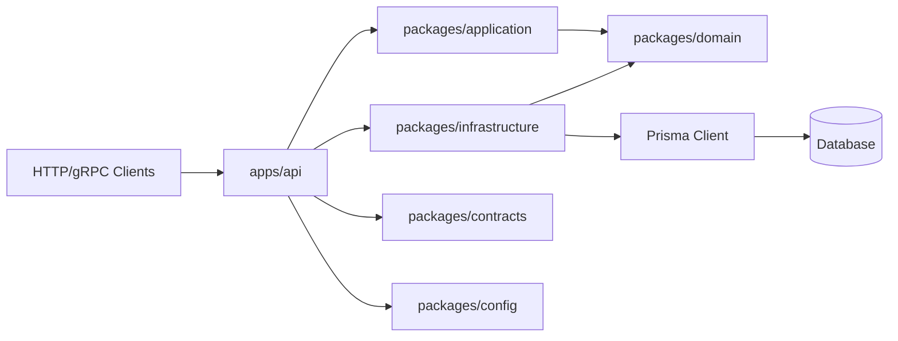
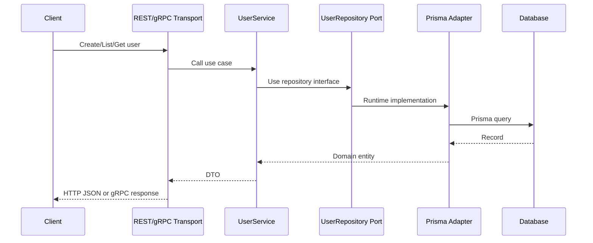

# Architecture

## High-Level Design

## Responsibilities

| Layer          | Responsibility                                                   | Must Not Own            |
| -------------- | ---------------------------------------------------------------- | ----------------------- |
| Domain         | Entities, business rules, repository contracts, domain factories | HTTP, gRPC, Prisma      |
| Application    | Use cases and orchestration                                      | Database implementation |
| Infrastructure | Prisma adapters and external system implementations              | Transport routing       |
| API App        | Composition root, REST routes, gRPC handlers                     | Business rules          |
| Contracts      | Shared gRPC proto files                                          | Runtime service logic   |
| Config         | Environment parsing                                              | Application behavior    |

## Data Flow Diagram

## Factory Design Pattern

Composition is intentionally centralized:

- `ContainerFactory` creates database clients, repositories, and application services.
- `FastifyAppFactory` creates and configures the REST API.
- `UserGrpcServerFactory` creates the gRPC server and binds service handlers.
- `UserFactory` creates and rehydrates domain entities.
- `UserServiceFactory` wires application services with repository interfaces.

This keeps construction separate from behavior and makes unit tests simple.
