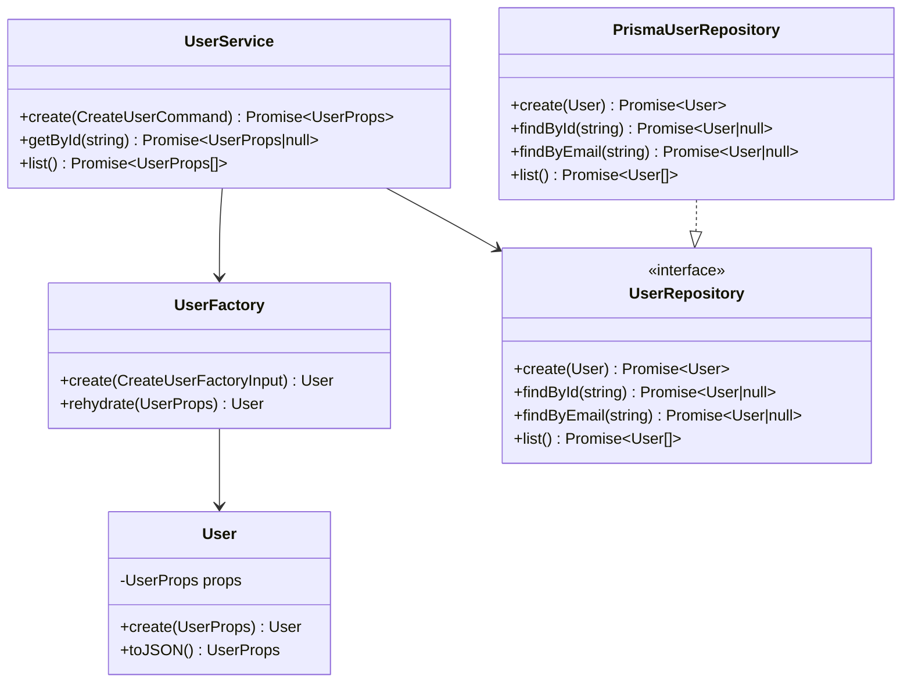

# Low-Level Design

## User Module Class Diagram

## SOLID Mapping

| Principle             | Implementation                                                                          |
| --------------------- | --------------------------------------------------------------------------------------- |
| Single Responsibility | Routes handle transport, services handle use cases, repositories handle persistence.    |
| Open/Closed           | New persistence adapters can implement `UserRepository` without changing `UserService`. |
| Liskov Substitution   | Any `UserRepository` implementation can replace `PrismaUserRepository`.                 |
| Interface Segregation | Domain repository ports expose only user persistence behavior.                          |
| Dependency Inversion  | Application depends on `UserRepository`, not Prisma.                                    |

## REST Endpoints

| Method | Path         | Use Case          |
| ------ | ------------ | ----------------- |
| GET    | `/health`    | Service readiness |
| POST   | `/users`     | Create user       |
| GET    | `/users`     | List users        |
| GET    | `/users/:id` | Get user by id    |

## gRPC Methods

| Method       | Request             | Response            |
| ------------ | ------------------- | ------------------- |
| `CreateUser` | `CreateUserRequest` | `UserResponse`      |
| `GetUser`    | `GetUserRequest`    | `UserResponse`      |
| `ListUsers`  | `ListUsersRequest`  | `ListUsersResponse` |
